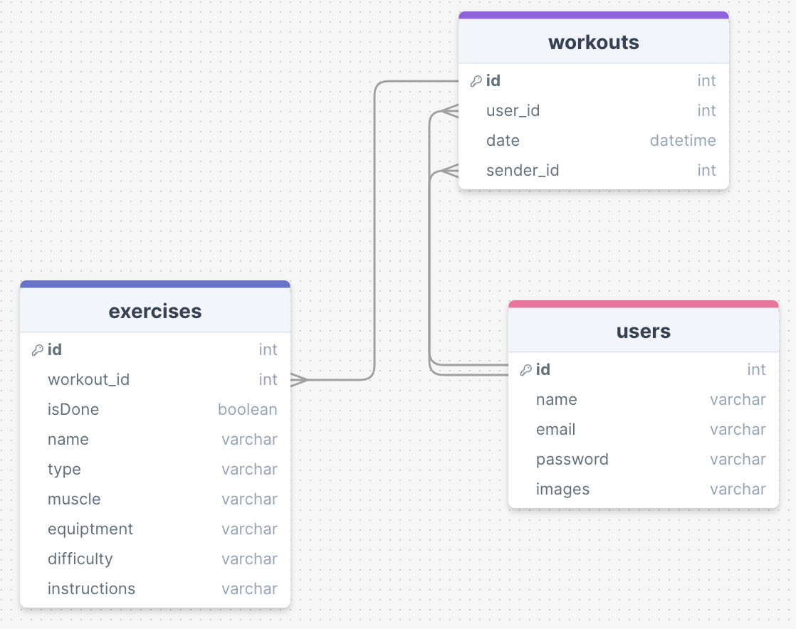

# Char & Giulia Fitness App

By Chardae Schnabel and Giulia Cellerino

## Table of Contents

- [Introduction](#introduction)
- [Motivation](#motivation)
- [Features & Views](#features--views)
- [Tools Used](#tools-used)
- [Getting Started](#getting-started)
- [Database Schema](#database-schema)
- [API Route](#api-route)
- [Future Features](#future-features)
- [Contact](#contact)
- [Acknowledgements](#acknowledgements)

## Introduction

Our app is designed to empower you with confidence and motivation as you embark on your fitness journey.

## Motivation

Giulia and Chardae, like many, often felt gym-intimidated and demotivated at home. Complex routines and lacking guidance made fitness daunting. They saw this shared struggle and the gap in supportive fitness apps.

Traditional apps often lack personalized guidance and motivation. Giulia and Chardae envisioned an app offering tailored workouts, flexible scheduling, and continuous motivation.

This fitness app focuses on building confidence and inspiring users of all levels. They believe everyone deserves empowerment and motivation in their fitness journey. With Char & Giulia Fitness App, users confidently embark, knowing they have a supportive companion every step.

## Features & Pages

This app is made up of the following pages:

- **Homepage:** Provides an overview of the app, featuring essential information and navigation options.
- **Login:** Allows users to authenticate and access their accounts securely.

- **Buildyourownworkout:** Enables users to customize their workout routines based on preferences and goals.

- **Calendar:** Displays scheduled workouts and fitness events, helping users plan and track their activities.

- **Exercise:** Offers detailed information and instructions for various exercises and workout routines.

- **Profile:** Allows users to manage their personal information, track progress, and customize settings.

- **Register:** Provides a registration form for new users to create accounts and join the app.

- **Sentworkouts:** Shows a history of sent or scheduled workout plans, facilitating organization and planning.

- **Sidebar:** Provides quick access to navigation options and additional features throughout the app.

- **Workout:** Presents structured workout routines and exercises tailored to user preferences.

## Tools Used

- **VS Code** - Source code editor
- **Github** - Version control platform
- **Gitbash** - Command line interface for Git
- **Postman** - API development and testing
- **MySQL** - Relational database management system
- **HTML** - Markup language for creating web pages
- **CSS** - Stylesheet language for styling web pages
- **JavaScript** - Programming language for web development
- **React.js** - JavaScript library for building user interfaces
- **Bootstrap** - Front-end framework for responsive web design
- **Node.js** - JavaScript runtime environment
- **Express** - Web application framework for Node.js
- **JWT** - JSON Web Tokens for authentication
- **Bcrypt** - Password hashing function
- **Trello** - Project management tool for organizing tasks
- **DrawSQL** - Tool for creating database diagrams
- **FullCalendar.io** - JavaScript calendar library for displaying events
- **Material-UI** - React component library for building UIs with Google's Material Design principles
- **Exercise API** - API for retrieving exercises and workout data from [Ninja API](https://api-ninjas.com/api/exercises)

## Getting Started

### Prerequisites

Before you begin, ensure you have the following installed on your local machine:

- [Node.js](https://nodejs.org/) - JavaScript runtime environment
- [npm](https://www.npmjs.com/) - Package managers for Node.js
- [MySQL](https://www.mysql.com/) - Relational database management system
- [Exercise API](https://api-ninjas.com/api/exercises) - Obtain your API key from the website.

### Installation

1. You need to create two (2) .env files.

- This .env goes in the client folder, as it contains the API Key accessible in the frontend

```javascript
VITE_RAPIDID_API_KEY = "Your_API_KEY";
```

- This .env goes in the root project folder

```javascript
DB_HOST = localhost;
DB_USER = root;
DB_NAME = fitnessapp;
DB_PASS = root;
SUPER_SECRET = your_supersecret;
```

2. Run the database

- Open a tab in your terminal and run:

```mySQL
mysql -u root -p
```

3. Create a new database called fitnessapp

```mySQL
CREATE DATABASE fitnessapp
```

4. Install NPM packages on both the server and on the client.

```javascript
cd fs35-team-A //or any name you have given //
npm install
cd client
npm install
```

5. Populates the database with the correct information.

```javascript
npm run migrate
```

6. To run the backend:

```javascript
npm start
```

7. To run the frontend:

```javascript
cd client
npm run dev
```

Frontend runs on http://localhost:5173/, and backend runs on http://localhost:4000.

## Database Schema



### Relationships

### Example Queries

## API Route

- Enpoints description
- We can create a PDF file and link it

## Future Features

### Instructions to add future features

## Contact

- Giulia Cellerino - giulia.cellerino@icloud.com
- Chardae Schnabel - chardaeschnabel@gmail.com

## Acknowledgements

- TA Pia Prozesky
- TA Zoe Laventhol
- Teacher Germinal Camps
